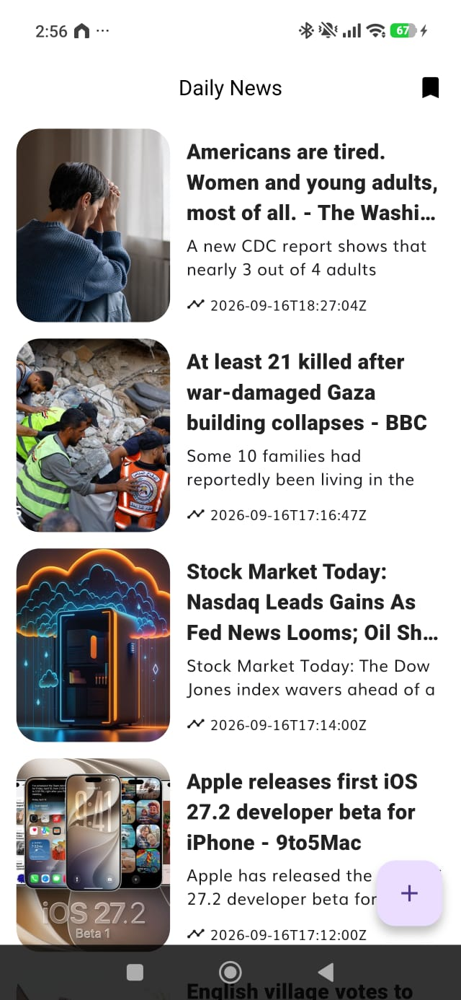
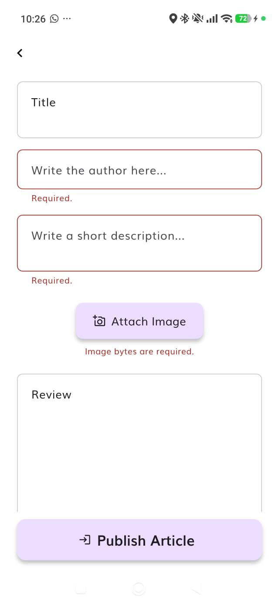
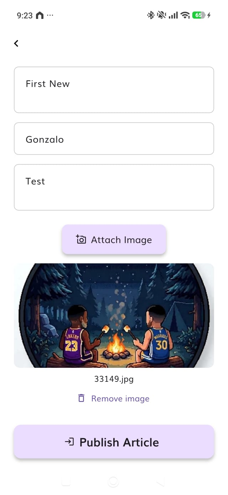
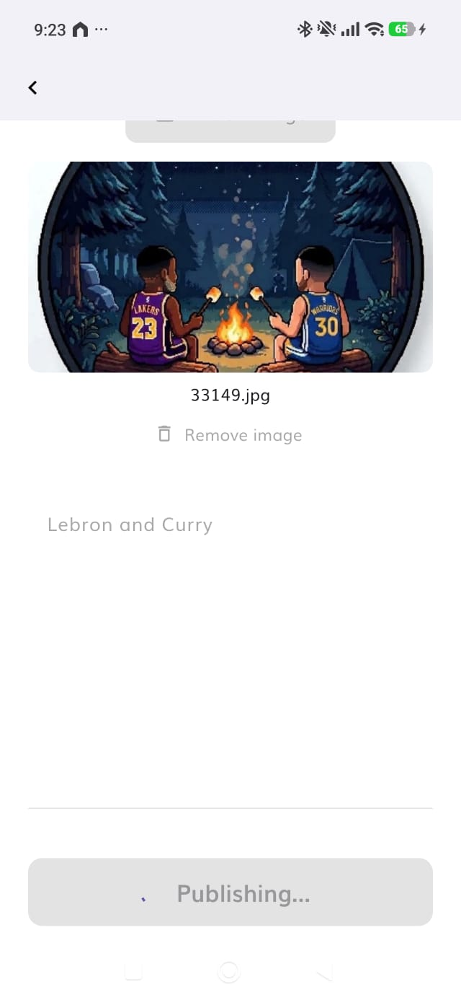
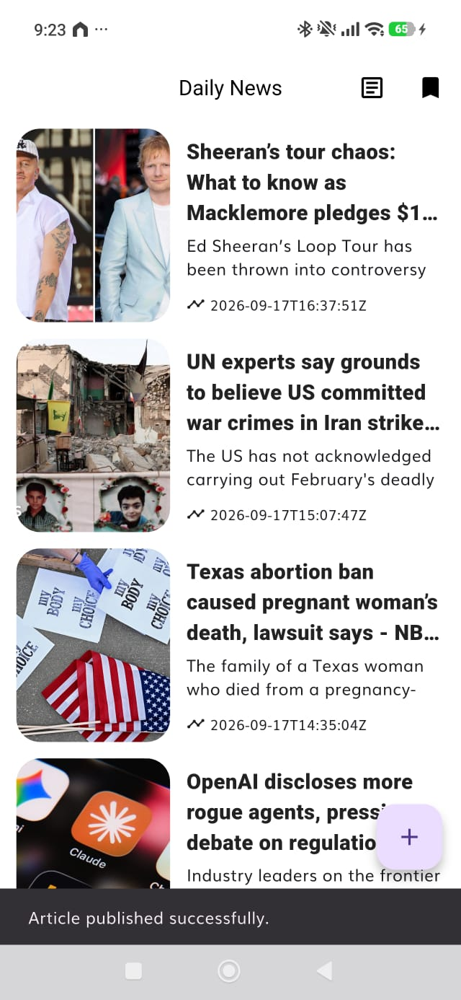
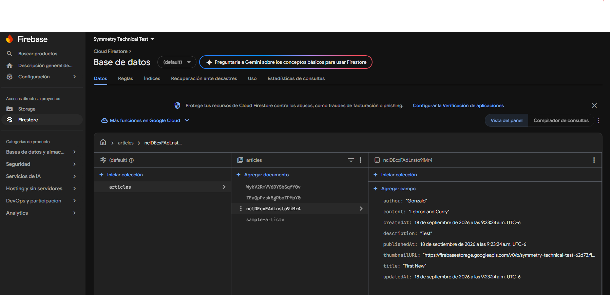
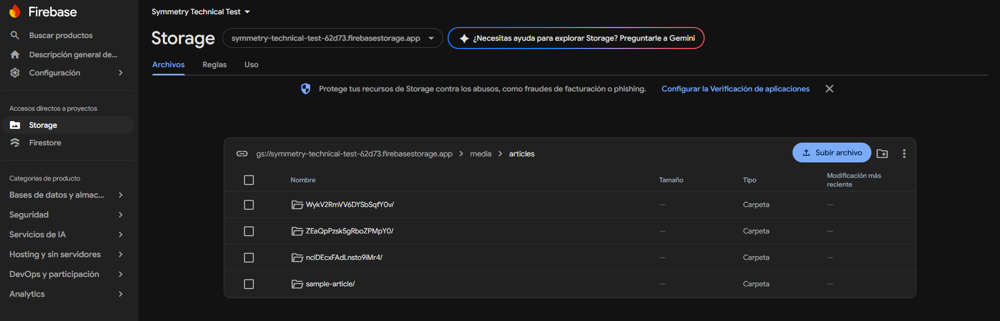
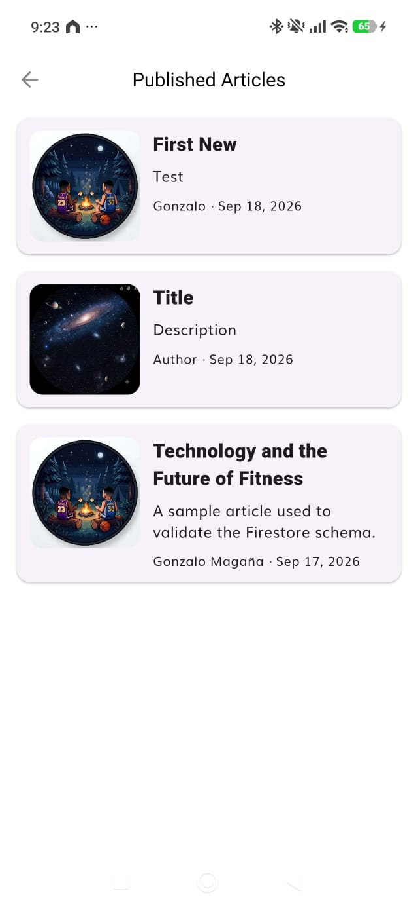
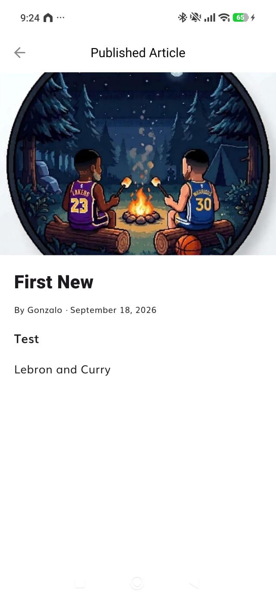

# Applicant Showcase App — Technical Test Report

## 1. Introduction

When I first reviewed this technical test, I saw it as both a challenge and an opportunity to work outside my usual development environment. My previous experience has mainly been in web and full-stack development, working with technologies such as React, JavaScript, Node.js, databases, APIs, and UI/UX design. I was also already familiar with the concepts behind Clean Architecture, but I had not previously applied them in a Flutter project.

Before starting this project, Flutter, Dart, Firebase, and BLoC/Cubit were all new technologies to me. This made the assignment particularly interesting because completing it required more than implementing a new feature: I first needed to understand a new language, framework, backend platform, state-management approach, and the architectural conventions defined by Symmetry.

My initial goal was therefore to avoid rushing directly into the implementation. I first focused on understanding the existing application, the technologies involved, and the responsibilities of the different architectural layers. From there, I approached the assignment incrementally: restoring and understanding the starter project, designing and securing the Firebase backend, implementing the business and presentation layers, connecting the application to real persistence, and finally validating the complete flow.

The required functionality was completed as a publishing flow that allows a user to create an article with its content and thumbnail and persist it using Cloud Firestore and Firebase Cloud Storage. After completing and validating the required scope, I also extended the application with a Published Articles flow that retrieves persisted articles from Firestore and allows users to browse them and open their details.

This report documents that learning process, the main technical challenges I encountered, the decisions made during development, the validation performed, and the additional work implemented beyond the required functionality.

## 2. Learning Journey

### 2.1 Starting with Flutter and Dart

Flutter and Dart were completely new to me when I started the project. My previous development experience helped me recognize familiar concepts such as components, asynchronous operations, routing, dependency management, and separation of responsibilities, but their implementation in Flutter required learning a different ecosystem and development model.

I started by studying the Flutter resources provided in the assignment and reinforcing them with documentation and practical experimentation. Rather than trying to learn the entire framework before writing code, I focused on the concepts required by the project and applied them incrementally while working with the existing codebase.

Working with the starter project also became part of the learning process. Before implementing the requested functionality, I had to understand how the existing News App was structured and restore compatibility with the current Flutter toolchain. This exposed me early to Flutter dependencies, code generation, Android build configuration, Retrofit, Floor, and the interaction between Dart packages and the native Android build system.

Once the existing application could build and run correctly, I had a stable foundation from which to implement the new functionality without confusing problems inherited from the starter project with problems introduced by my changes.

### 2.2 Learning Firebase

Firebase was also new to me before this assignment. I studied how Flutter integrates with Firebase and then focused specifically on the services required by the project: Cloud Firestore and Firebase Cloud Storage.

One of the most important concepts I learned was that Firestore does not enforce a traditional database schema by itself. Because of this, defining the Article structure was only one part of the backend work; the expected structure and constraints also needed to be enforced through Firebase Security Rules.

I designed the Article document around the information required by the publishing flow and stored article thumbnails separately in Cloud Storage. Firestore stores the structured article data and the thumbnail URL, while the binary image is stored under the `media/articles/{articleId}` hierarchy in Cloud Storage.

Security Rules became an important part of this learning process. I implemented validation for required fields, accepted types, string limits, timestamps, image formats, file size, allowed paths, and permitted operations. I also learned to validate these rules through the Firebase Emulator Suite rather than relying only on manual tests or successful deployments.

### 2.3 Applying BLoC/Cubit and Clean Architecture

BLoC and Cubit were new concepts for me, while Clean Architecture was something I already understood conceptually. This project gave me the opportunity to apply those architectural ideas in a codebase with explicit restrictions on how the presentation, business, and data layers communicate.

Following the assignment sequence was particularly useful for understanding those boundaries. The Business Layer was implemented first using mock data inside the use case, as required by the assignment. The Presentation Layer could then depend on that use case without needing Firebase. Finally, when implementing the Data Layer, the mock behavior was replaced with a repository implementation backed by Firestore and Cloud Storage.

The publishing flow therefore evolved from:

`Presentation → Cubit → Use Case → Mock`

to:

`Presentation → Cubit → Use Case → Repository → Firebase`

without requiring the UI to know how persistence was implemented.

I used Cubit to represent the publishing form state, including user input, thumbnail selection, validation failures, submission progress, success, and unexpected failures. Keeping this state outside the widgets made it possible to preserve the form during failures, prevent duplicate submissions, provide explicit publishing feedback, and test the behavior independently from the UI.

### 2.4 Learning Through Validation

Testing became another important part of the learning process. I did not want to rely only on the fact that the application compiled or that a successful manual publication worked.

As the implementation progressed, I added tests around the business rules, Cubits, widgets, navigation, data layer, dependency composition, Firebase Security Rules, and Firebase emulator integration. Some of these tests exposed behavior that was not obvious during implementation. For example, Storage testing revealed that preventing updates alone was not sufficient to express the intended no-overwrite behavior in the emulator, which led to explicitly checking that the target resource did not already exist.

I also encountered a difference between the Firebase Storage Emulator and production Firebase Storage: the emulator produces a local HTTP URL, while the production Firestore rules require the expected HTTPS Firebase Storage URL. Instead of weakening the production rules to accommodate the testing environment, I documented and tested that incompatibility and later validated the complete publishing flow against the real Firebase project.

By the end of the implementation, I had moved from having no previous experience with Flutter, Dart, Firebase, or BLoC/Cubit to using them together in a layered application, testing their interactions, and extending the same architecture with an additional Firestore-backed reading flow.

## 3. Challenges Faced

### 3.1 Restoring and Understanding the Starter Project

The first major challenge appeared before implementing the requested functionality. The starter project had been built against older versions of Flutter, Dart, Gradle, Kotlin, and several dependencies, so it could not build correctly with my current development environment.

Rather than performing an unrestricted dependency upgrade, I updated the incompatible parts incrementally and validated the project after each group of changes. This included resolving compatibility issues involving Android build tooling, Flutter plugins, Dio, Floor, Retrofit, and code generation.

Once the project compiled, I encountered a second issue: NewsAPI returned successful HTTP responses, but no articles appeared in the application. Inspecting the API response revealed that the existing Retrofit contract expected a list at the root level, while NewsAPI actually returned an object containing metadata and an `articles` list.

I corrected the contract by introducing a response model that represents the actual API envelope and allowing the repository to expose only the article collection required by the application.

This stage reinforced an important debugging lesson for me: a successful HTTP response does not necessarily mean that the application's data contract is correct. Verifying the actual response and tracing data through the application was more useful than assuming the problem was in the UI.

### 3.2 Designing and Enforcing the Firebase Backend

Firestore was new to me, and designing the Article schema required understanding that Firestore does not enforce a traditional database schema automatically.

I defined the article documents in Firestore while storing thumbnails separately in Firebase Cloud Storage. The same article identifier is used to relate the Firestore document with its image under `media/articles/{articleId}`.

The more challenging part was enforcing that design through Security Rules. The rules validate the expected fields, data types, string constraints, timestamps, thumbnail URL, image MIME types, file size, storage paths, and allowed operations.

Automated rule testing was particularly useful here. A Storage test exposed that simply denying updates did not fully express the intended no-overwrite behavior in the emulator. I therefore added an explicit check that the target resource does not already exist before allowing an upload.

This showed me the difference between designing a security policy and verifying that the platform actually enforces the policy as intended.

### 3.3 Connecting the Layers Without Breaking Architectural Boundaries

Another challenge was connecting the publishing feature from the UI to Firebase while respecting Symmetry's Clean Architecture restrictions.

The assignment intentionally required the Business Layer to begin with mock data inside the use case. This allowed the Presentation Layer to be implemented and tested before real persistence existed. Later, the Data Layer had to replace that behavior with actual Firebase providers.

The resulting transition was:

`Presentation → Cubit → Use Case → Mock`

to:

`Presentation → Cubit → Use Case → Repository → Firebase`

The main challenge was making that transition without introducing Firebase dependencies into the Business or Presentation layers. Repository interfaces remained in the domain, Firebase-specific implementations remained in the Data Layer, and dependency injection connected the implementations at the application composition root.

This helped me understand Clean Architecture beyond its folder structure: the important part is controlling dependency direction so that infrastructure can change without forcing unrelated layers to change with it.

### 3.4 Testing Firebase Without Weakening Production Rules

During integration testing, I encountered a difference between Firebase's local environment and the real service. The Storage Emulator returns local HTTP download URLs, while the Firestore Security Rules intentionally accept the production HTTPS Firebase Storage URL format.

As a result, a fully emulated Storage-to-Firestore publishing flow could not satisfy the same URL constraint used in production.

Instead of relaxing the production Security Rules only to make the emulator test pass, I kept the production constraint intact and added a negative integration test documenting the incompatibility. I then validated the complete publishing flow against the real Firebase project using a physical Android device.

The final validation confirmed that an article could be created from the application, its thumbnail persisted in Cloud Storage, its document persisted in Firestore, and the data remained available after closing the application.

This challenge reinforced an important testing principle for me: the test environment should help validate production behavior, but production constraints should not be weakened simply to accommodate limitations of the test environment.

## 4. Reflection and Future Directions

### 4.1 Reflection

This project was particularly valuable to me because it required applying several technologies that I had not used before in a real development flow rather than learning them independently through isolated exercises.

At the beginning of the assignment, Flutter, Dart, Firebase, and BLoC/Cubit were all new to me. By the end, I had used them together to implement and validate a feature across the business, presentation, and data layers, including state management, persistence, security rules, automated testing, and Android integration.

One of my main takeaways was the importance of understanding an existing codebase before adding functionality to it. Restoring the starter project, investigating its architecture, and validating its existing behavior gave me a much clearer foundation for implementing the assignment without unnecessarily rewriting working parts of the application.

The project also changed how I think about Clean Architecture. I was already familiar with its concepts, but applying Symmetry's dependency restrictions made the practical value of those boundaries much clearer. Being able to develop the Presentation Layer against a mocked use case and later replace the persistence mechanism without redesigning the UI demonstrated why dependency direction and repository abstractions matter.

Another important takeaway was the role of validation throughout development. Compilation was only one checkpoint. Unit and widget tests, Firebase Security Rules tests, emulator integration tests, Android builds, and finally validation against the real Firebase project provided different levels of confidence and also exposed issues that would not have been visible from a successful build alone.

Professionally, the experience reinforced an approach I want to continue using: understand the system first, implement changes incrementally, validate assumptions with evidence, and treat testing and documentation as part of the implementation rather than as tasks to add only at the end.

### 4.2 Known Limitations

The current implementation intentionally remains within the scope and constraints of the assignment in several areas.

Firebase Authentication is not part of the requested functionality, so article creation is currently available without an authenticated user identity. Because there is no ownership model, updates and deletions are intentionally denied by the Security Rules rather than allowing clients to modify content they cannot prove they own.

The publishing process also involves two separate Firebase resources: the thumbnail in Cloud Storage and the article document in Firestore. If the image upload succeeds but document creation fails afterward, an orphaned Storage object could remain. The current implementation recognizes this consistency limitation but does not introduce additional backend infrastructure solely to solve a scenario outside the required scope.

Publication reconciliation for an uncertain Firestore write is session-scoped. The repository retains the original publication attempt while the application process remains alive, allowing the same article ID and write operation to be reconciled without creating a duplicate publication. However, this recovery state is not persisted across a full application restart.

The project also retains a small number of analyzer diagnostics inherited from the starter code and a warning related to a future Kotlin Gradle Plugin migration. These do not prevent the current application from building or operating, but they would be reasonable maintenance items in a longer-lived project.


### 4.3 Future Improvements

If I continued developing the application toward a production environment, my first priority would be introducing Firebase Authentication and an authorization model for journalists or administrators. Security Rules could then use authenticated identity and roles to control article creation, editing, and deletion instead of relying on public creation with strict validation.

I would also add Firebase App Check and additional abuse protection around write operations. For publication consistency, I would investigate a coordinated backend workflow or compensating cleanup mechanism so that a failed Firestore operation does not leave an unused image in Cloud Storage.

From the product perspective, the Published Articles feature could evolve into a complete content-management flow. Authenticated authors could manage their own publications, edit drafts, replace thumbnails, delete articles, and distinguish between draft and published states.

Finally, I would continue improving automated validation and the development workflow as the application grows, particularly around end-to-end testing, continuous integration, dependency maintenance, and architecture checks. The current project provides a useful foundation for those improvements because the main publishing and reading flows are already separated into explicit architectural layers.

## 5. Proof of the Project

The final application was validated on a physical Android device and against the real Firebase project. The following screenshots document the main publishing flow, persistence, and the additional Published Articles functionality.

### 5.1 Existing News Application

Before implementing the new functionality, I restored and validated the existing Daily News flow. The application successfully retrieves and displays articles from NewsAPI, including their images and details.

<p align="center">
  
</p>

### 5.2 Article Publishing

The publishing screen allows the user to enter the article information and select a JPEG, PNG, or WebP thumbnail. Validation feedback is displayed without discarding the user's current form state.

<p align="center">
  
  &nbsp;&nbsp;
  
</p>

During submission, the interface provides explicit progress feedback and prevents additional publication actions until the current operation finishes. After a successful publication, the application returns to Home and confirms the result.

<p align="center">
  
  &nbsp;&nbsp;
  
</p>

### 5.3 Firebase Persistence

A successful publication persists two related resources: the article document in Cloud Firestore and its thumbnail in Firebase Cloud Storage.

The Firestore document contains the article data defined by the backend schema, while the thumbnail is stored under the `media/articles/{articleId}` hierarchy in Cloud Storage.

<p align="center">
  
</p>

<p align="center">
  
</p>

Persistence was also validated by closing the application after publication and confirming that the resources remained available in Firebase.

### 5.4 Published Articles

As additional functionality beyond the required publishing flow, the application can retrieve the articles persisted in Firestore, display them ordered by publication date, and open their complete details.

<p align="center">
  
  &nbsp;&nbsp;
  
</p>

This completed the manually validated end-to-end flow:

`Android → Publish Article → Firebase → Published Articles → Article Detail`

### 5.5 Demo Video

A short end-to-end demonstration of the final application is available here:

**[Watch the final application demo](./report-assets/app-demo.mp4)**

The demo covers the main user flow from article creation and thumbnail selection through publication, persistence, and retrieval from the Published Articles section.

## 6. Overdelivery

After completing the functionality required by the assignment, I used the remaining development time to extend the project in areas that could provide additional product value and engineering confidence.

The main additional feature was a complete read flow for articles published through the application. I also expanded the publishing experience with clearer state feedback and added automated validation beyond what was explicitly required by the assignment.

### 6.1 Published Articles

The original assignment focuses on allowing a journalist to create and persist an article. After completing that flow, I added the ability to retrieve those publications from Firestore and browse them inside the application.

The additional flow is:

`Home → Published Articles → Article List → Article Detail`

Published Articles retrieves persisted articles directly from Firestore and orders them by `publishedAt`, displaying the most recent publications first. Selecting an article opens a detail screen containing its persisted information and thumbnail.

I implemented this functionality using the same architectural boundaries as the publishing feature rather than accessing Firestore directly from the UI. The read flow includes its own domain contract and use case, Firestore data source and repository implementation, Cubit and presentation states, list and detail screens, and dependency injection configuration.

This made the feature useful not only as an additional user-facing capability, but also as another validation of the architecture: the same persisted data created through the publishing flow can be retrieved through an independent read flow without introducing a second source of truth or relying on in-memory state.

The complete flow was manually validated on a physical Android device against the real Firebase project:

`Android → Publish Article → Firebase → Published Articles → Article Detail`

The screenshots and demo in the previous section show this functionality in the final application.

### 6.2 Publishing Experience Improvements

Beyond the basic ability to submit an article, I implemented explicit UI states to make the publishing process clearer and more resilient.

The interface provides feedback while an article is being published, prevents duplicate submissions during the operation, preserves the form when validation or unexpected failures occur, allows the user to retry, and displays field-specific validation feedback without discarding unrelated input.

After a successful publication, the form closes and Home displays confirmation that the article was published successfully.

These behaviors were implemented through the publishing Cubit and use case rather than embedding the publishing logic directly in the widgets.

The publishing flow also handles an uncertain Firestore confirmation state. A native Firestore write may remain pending after connectivity is interrupted, so the application uses a bounded foreground wait instead of blocking the interface indefinitely. If confirmation cannot be obtained within that period, the UI reports that publication confirmation is pending rather than incorrectly reporting either success or failure.

The original publication attempt, article ID, Storage path, and native write operation are retained for the repository session. Confirmation checks reconcile that same attempt instead of creating a new article or repeating the upload. This reduces the risk of duplicate publications while allowing the user to leave the form and later check whether the original publication completed.

### 6.3 Additional Engineering Validation

I also extended the project with automated testing and validation that were not explicitly required by the assignment.

This included automated Firebase Security Rules tests covering valid and invalid Firestore documents, field constraints, timestamps, Storage paths, supported image formats, file-size boundaries, overwrite attempts, updates, and deletions.

Additional emulator safety and integration tests were implemented to verify persistence behavior while preventing the test suite from accidentally depending on the real Firebase project.

On the Flutter side, automated coverage was added across the business, presentation, and data responsibilities, including use cases, Cubits, widgets, navigation, Firebase data access abstractions, repository behavior, and dependency composition.

The final automated quality gate reached:

| Validation | Final result |
| --- | --- |
| Flutter tests | 209/209 passed |
| Firebase Security Rules tests | 53/53 passed |
| Emulator safety tests | 8/8 passed |
| Integration + safety tests | 20/20 passed |
| Flutter analyze | 0 new errors; 8 inherited diagnostics remain |
| Android debug APK | Built successfully |
| Git diff check | Passed |

Automated validation was complemented with a physical Android end-to-end test against the real Firebase project. This confirmed the publishing and reading flows beyond isolated unit or emulator environments.

### 6.4 How I Would Improve This Further

The next major improvement I would prioritize is authentication and article ownership. With Firebase Authentication and an authorization model, journalists could securely manage their own publications rather than relying on public creation and globally disabled update/delete operations.

This would make it possible to extend Published Articles into a more complete content-management experience with editing, deletion, draft and published states, and author-specific views.

I would also strengthen backend protection with Firebase App Check and investigate a coordinated publication or cleanup mechanism for cases where a thumbnail upload succeeds but the Firestore document cannot subsequently be created.

Finally, as the project grows, I would move the existing automated quality checks into a continuous integration pipeline so that tests, static analysis, Firebase rule validation, and build verification can run consistently for every proposed change.

## 7. Technical Implementation

### 7.1 Requirements Coverage

The implementation followed the assignment incrementally, keeping the required functionality separate from the additional work described in the Overdelivery section.

| Area | Implementation |
| --- | --- |
| Article schema | Defined and documented the Firestore Article structure |
| Thumbnail storage | Firebase Cloud Storage under `media/articles/{articleId}/{fileName}` |
| Firestore | Article persistence implemented through the Data Layer |
| Security Rules | Firestore and Storage access, schema, type, timestamp, path, MIME, and size constraints |
| Firebase setup | Flutter application connected and initialized with the Firebase project |
| Business Layer | Publishing entities, parameters, repository contract, validation, use case, and the assignment-required mock stage |
| Presentation Layer | Publishing Cubit, states, form, image selection, validation feedback, progress, success, and failure handling |
| Data Layer | Firebase repository and data sources replacing the temporary mock behavior |
| Persistence | Articles and thumbnails remain available after the application is closed |
| Report | Development process, evidence, challenges, reflection, and implementation documented here |
| Additional functionality | Firestore-backed Published Articles list and Article Detail flow |

### 7.2 Architecture

The publishing functionality follows the three-layer architecture defined for the project:

```text
Presentation
  PublishArticlePage
  PublishArticleCubit
          |
          v
Domain / Business
  PublishArticleUseCase
  PublishArticleRepository
  PublishArticleParams
  PublishableArticle
          ^
          |
Data
  PublishArticleRepositoryImpl
      |                 |
      v                 v
Firestore          Cloud Storage
Data Source        Data Source
```

At runtime, the Presentation Layer invokes the use case, which communicates through the repository contract defined in the Domain Layer. Dependency injection connects that contract to the Firebase-backed repository implementation.

The source-code dependency direction remains toward the Domain Layer: the Presentation Layer depends on Domain, the Data Layer depends on Domain, and Domain remains independent from Firebase infrastructure and Flutter UI concerns.

```text
Source-code dependencies

Presentation ──────> Domain <────── Data
                         ^
                         |
                  Pure business logic
```

This separation also allowed the assignment-required mock implementation to be used during the Business and Presentation stages and later replaced by real Firebase persistence without redesigning the UI.

Image selection follows the same dependency direction. The image-picker abstraction is defined as a Domain contract, while the concrete gallery implementation that depends on the Flutter `image_picker` package is located in the Data Layer. The Presentation Layer therefore requests image selection through the abstraction without owning the platform-specific gallery dependency.

```text
Presentation
    |
    v
ArticleImagePicker (Domain contract)
    ^
    |
GalleryArticleImagePicker (Data implementation)
    |
    v
image_picker / Android gallery
```

This keeps the external device integration outside the Presentation and Domain implementations while still allowing the publishing UI to consume the selected thumbnail through a domain-level representation.

### 7.3 Article Data Model

Each persisted article is stored in Firestore at:

```text
articles/{articleId}
```

The document contains eight fields:

| Field | Type | Purpose |
| --- | --- | --- |
| `author` | string | Article author |
| `title` | string | Article title |
| `description` | string | Short article description |
| `content` | string | Full article content |
| `thumbnailURL` | string | Cloud Storage download URL |
| `publishedAt` | timestamp | Publication timestamp |
| `createdAt` | timestamp | Creation timestamp |
| `updatedAt` | timestamp | Last-update timestamp |

The article ID is represented by the Firestore document ID rather than duplicated as a document field.

Thumbnail binaries are stored separately using:

```text
media/articles/{articleId}/{fileName}
```

This keeps structured article data in Firestore while Cloud Storage handles the binary media associated with the publication.

### 7.4 Publishing Flow

The final publishing process is:

```text
User completes article form
        |
        v
PublishArticleCubit
        |
        v
PublishArticleUseCase
  - Normalizes input
  - Validates business rules
        |
        v
PublishArticleRepository
        |
        v
PublishArticleRepositoryImpl
        |
        +--> Generate article ID
        |
        +--> Upload thumbnail to Cloud Storage
        |
        +--> Obtain thumbnail download URL
        |
        +--> Create Firestore document
        |
        +--> Retrieve persisted article
        |
        v
Success returned to Presentation
```

If the Firestore write does not settle within the bounded foreground wait, the operation is not immediately classified as either success or failure. Instead, the application exposes a pending-confirmation outcome and retains the original publication attempt for the repository session. A later confirmation check reconciles that same article ID and native write operation rather than submitting a new publication.

The same `articleId` connects the Firestore document and its Storage hierarchy.

Validation is performed before persistence so invalid publishing requests do not unnecessarily reach Firebase. Firebase Security Rules then provide a second enforcement boundary on the backend.

### 7.5 Security Model

The current security model reflects the scope of the assignment, which does not include authentication.

Firestore allows article reads and validated article creation. Updates and deletions are denied. Create operations must match the expected document schema and satisfy field, type, length, timestamp, and thumbnail URL constraints.

Cloud Storage allows reads from the article media hierarchy and restricts creation to the expected path, supported JPEG/PNG/WebP image types, and the configured file-size limit. Replacement and deletion are denied.

This creates two validation boundaries:

```text
Application / Domain Validation
              |
              v
       Firebase Request
              |
              v
Firebase Security Rules
              |
              v
        Persistence
```

Client-side validation provides immediate feedback and protects the application flow, while Firebase Security Rules remain responsible for enforcing backend constraints independently of the client.

Authentication, ownership, role-based authorization, and additional abuse protection are intentionally identified as future production improvements rather than being simulated within the current assignment scope.

## 8. Running and Evaluating the Project

The repository separates the Flutter application and Firebase backend configuration into the following directories:

```text
starter-project/
├── backend/
│   ├── docs/
│   ├── tests/
│   ├── firestore.rules
│   ├── storage.rules
│   └── firebase.json
├── frontend/
│   ├── lib/
│   ├── test/
│   └── firebase.json
└── docs/
    ├── REPORT.md
    └── report-assets/
```

### 8.1 Flutter Application

From the `frontend` directory, install the project dependencies:

```bash
flutter pub get
```

Run the automated Flutter test suite:

```bash
flutter test
```

Run static analysis:

```bash
flutter analyze --no-pub
```

Build the Android debug APK:

```bash
flutter build apk --debug
```

To run the application on a connected Android device:

```bash
flutter run
```

The application requires the Firebase configuration included for the technical-test project and network access for the existing NewsAPI functionality and Firebase services.

### 8.2 Firebase Backend Validation

From the `backend` directory, install the Node.js dependencies:

```bash
npm install
```

Run the Firebase Security Rules test suite:

```bash
npm test
```

Run the emulator safety checks:

```bash
npm run test:safety
```

Run the integration and safety validation:

```bash
npm run test:integration
```

These tests use the Firebase Emulator Suite and the project's emulator-safety configuration to avoid unintentionally targeting the real Firebase project during automated backend validation.

### 8.3 Manual Evaluation Flow

For a quick manual evaluation of the completed functionality:

1. Open the Daily News application.
2. Use the publishing action from Home.
3. Enter the article title, author, description, and content.
4. Select a supported thumbnail image.
5. Publish the article.
6. Confirm the successful publication feedback.
7. Open **Published Articles** from Home.
8. Confirm that the newly persisted article appears in the list.
9. Open the article and verify its content and thumbnail in **Article Detail**.

This exercises the final end-to-end path:

```text
Android
   ↓
Publish Article
   ↓
Business Validation
   ↓
Cloud Storage + Firestore
   ↓
Published Articles
   ↓
Article Detail
```

The screenshots and video included in [Section 5](#5-proof-of-the-project) provide additional evidence of this flow running against the real Firebase project.

---

## Conclusion

This technical test started as my first practical experience with Flutter, Dart, Firebase, and BLoC/Cubit and developed into an opportunity to apply those technologies together within an existing Clean Architecture codebase.

The final implementation covers the requested backend, business, presentation, and data responsibilities; persists articles and thumbnails through Firebase; enforces backend constraints through Security Rules; and validates the application through automated tests and a physical Android end-to-end flow.

Beyond the required publishing functionality, I extended the application with a Firestore-backed Published Articles and Article Detail flow so that content created through the application can also be retrieved and consumed inside it.

More importantly, the project reinforced the value of understanding an existing system before modifying it, maintaining explicit dependency boundaries, validating assumptions through tests and real execution, and treating security and documentation as part of the implementation itself.

There are still clear directions in which the application could evolve, particularly authentication, ownership, content management, stronger abuse protection, publication consistency, and continuous integration. The current implementation provides a tested architectural foundation from which those capabilities could be developed.